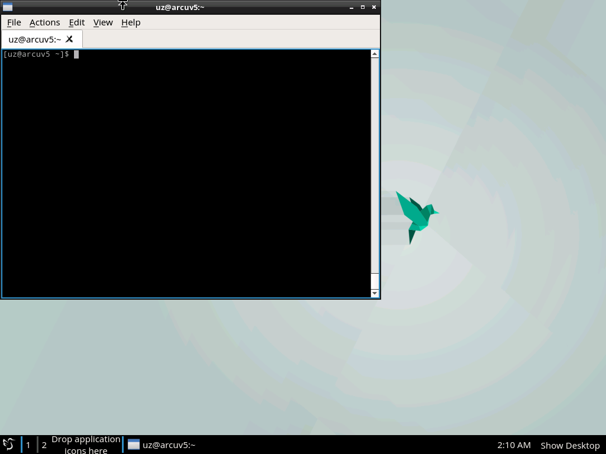

# Note of install archlinux on hyperv with uefi boot and lxqt desktop
## 0. Add RemoteFX 3D 視訊卡: 
## 1. 硬碟分割與格式化
```bash
lsblk
cfdisk /dev/sda
---
gpt
===
/dev/sda1 esp
/dev/sda2 linux file system
/dev/sda3 linux swap
---
mkfs.vfat -v -F 32 /dev/sda1
mkfs.ext4 /dev/sda2
mkswap /dev/sda3
swapon /dev/sda3
```

## 2. 設定鏡像與網路
```bash
nano /etc/pacman.d/mirrorlist
---
Server = http://archlinux.cs.nctu.edu.tw/$repo/os/$arch
---
ip route add <gateway> dev eth0
ip route add default via <gateway> dev eth0
ip addr add <ip>/24 broadcast <broadcast> dev eth0
echo 'nameserver 8.8.8.8 >> /etc/resolv.conf'
echo 'nameserver 8.8.4.4 >> /etc/resolv.conf'
ping -c 4 tw.yahoo.com
```

## 3. 掛載硬碟
```bash
mount /dev/sda2 /mnt
mkdir /mnt/boot
mount /dev/sda1 /mnt/boot
pacstrap -i /mnt base base-devel intel-ucode grub
```

## 4. 產生fstab
```bash
genfstab -U -p /mnt > /mnt/etc/fstab
```
(**ps**: genfstab -U -p /mnt | sudo tee /mnt/etc/fstab # archbox)

```bash
arch-chroot /mnt /bin/bash
```

## 5. 設定語言與時區
```bash
echo LANG=en_US.UTF-8 > /etc/locale.conf 
echo <hostname> > /etc/hostname
nano /etc/locale.gen
---
en_US.UTF-8 UTF-8
zh_TW.UTF-8 UTF-8
---
locale-gen
ln -sf /usr/share/zoneinfo/Asia/Taipei /etc/localtime
hwclock --systohc --utc
timedatectl
timedatectl set-timezone Asia/Taipei
```

## 6. 設定使用者
```bash
useradd -m -g users -s /bin/bash <username>
passwd <username>
visudo
---
<username> ALL=(ALL) ALL
---
```

## 7. 安裝開機檔案
```bash
pacman -S efibootmgr
grub-install --recheck /dev/sda --efi-directory=/boot
nano /etc/default/grub
---
GRUB_CMDLINE_LINUX_DEFAULT="quiet splash video=hyperv_fb:800:600"
---
grub-mkconfig -o /boot/grub/grub.cfg
```

## 8. 設定網路腳本
```bash
nano /home/<username>/setstaticnetwork.sh
---
#!/bin/bash

echo -n 'device: '
read d
echo -n 'gateway: '
read g
echo -n 'netmask: '
read m
echo -n 'broadcast: '
read b
echo -n 'ip: '
read ip
echo -n 'dns: '
read dns

ip link set dev $d up
ip route add $g dev $d
ip route add default via $g dev $d
ip addr add $ip/$m broadcast $b dev $d

echo 'nameserver '$dns > /etc/resolv.conf
---
bash /home/<username>/setstaticnetwork.sh
```

## 9. 安裝視窗環境+視窗管理+桌面
```bash
pacman -S xorg-server xorg-xinit xorg-utils xorg-server-utils xorg-twm xterm xorg-xclock
pacman -S xf86-video-fbdev
pacman -S lxqt
pacman -S sddm slock
systemctl enable sddm
systemctl start sddm
pacman -S sakura pcmanfm
cp /etc/X11/xinit/xinitrc /home/<username>/.xinitrc
nano /home/<username>/.xinitrc
---
... &
exec startlxqt
---
nano /home/<username>/.bash_profile
---
[[ -z $DISPLAY && $XDG_VTNR -eq 1 ]] && exec startx
---
```

## 結束安裝

```bash
exit
umount -R /mnt
reboot now
```

## 畫面


